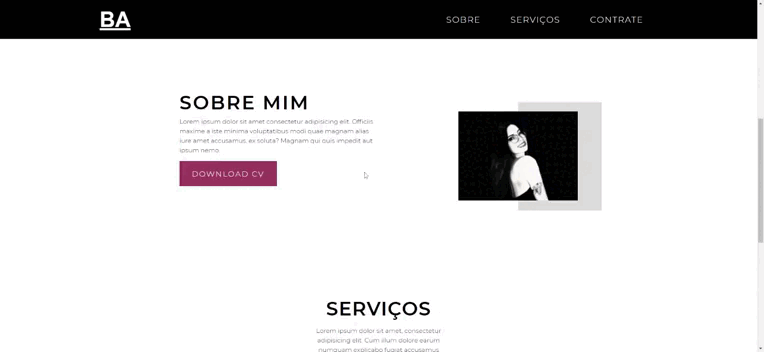

<h1 align="center"> :desktop_computer: Demonstração </h1>

***
### :mag: Sobre  
Projeto realizado para práticar a construção de sites com HTML, CSS e JS.  
Este site representa um portifólio pessoal para iniciantes. Com a construção deste portifólio é possivel aprender a transformar o site em um design responsivo, 
criar barra de navegação responsiva com menu móvel e como fazer flip box box com css. 
Os ícones das Redes Sociais você pode encontrar no site: https://fontawesome.com/  

***
### :hammer_and_wrench: Ferramentas Utilizadas  
- 
- 
- 
